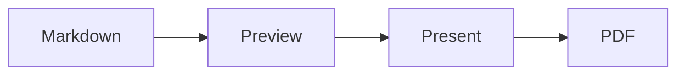

# present

### Browser-based presentations for developers

Built with markdown. Runs in your browser. No fluff.

---

## Why `present`?

- Write slides in **plain markdown**
- Code blocks with **syntax highlighting**
- Dark mode, always
- IBM Plex Mono — beautiful monospace typography
- Keyboard navigation: `← →` `Space` `O` `F`

---

## Image Layout System

Place images anywhere with a title directive:

```markdown


```

| Directive      | Effect                        |
|----------------|-------------------------------|
| `right`        | Image on right half           |
| `left`         | Image on left half            |
| `bg`           | Fullscreen background         |
| `opacity:N`    | Transparency (0.0 – 1.0)     |

---

## Code Example

```typescript
interface Slide {
  html: string;
  bgImage?:    PositionedImage;
  rightImage?: PositionedImage;
  leftImage?:  PositionedImage;
}

function parseSlides(markdown: string): Slide[] {
  return markdown
    .split(/\n---\n/)
    .filter(Boolean)
    .map(raw => processSlide(raw));
}
```

---

## Blockquotes & Inline Code

> "Any fool can write code that a computer can understand.
> Good programmers write code that humans can understand."
> — *Martin Fowler*

Use `present file.md` to launch. Pass `--port 3000` to pick your port.

Inline code looks like `const x = 42` or `npm install -g present`.

---

## Tables & Lists

### Keyboard Shortcuts

| Key           | Action                |
|---------------|-----------------------|
| `→` / `Space` | Next slide            |
| `←`           | Previous slide        |
| `O`           | Overview mode         |
| `F`           | Toggle fullscreen     |
| `Home` / `End`| First / last slide    |

---

## A Right-Side Image

This slide has content on the left and an image panel on the right.

- The image scales to fit
- Opacity is controllable
- Works great for diagrams, screenshots, charts


---

## Background Image

Great for title slides or section dividers.

The text sits on top with full readability.


---

## Math and Mermaid

KaTeX keeps formulas in the Markdown:

$$
T(n) = T(n/2) + O(n) = O(n)
$$



---

# Thank you

{reveal}
```bash
npx present slides.md
```

Made with ❤️ and too much coffee {reveal}
